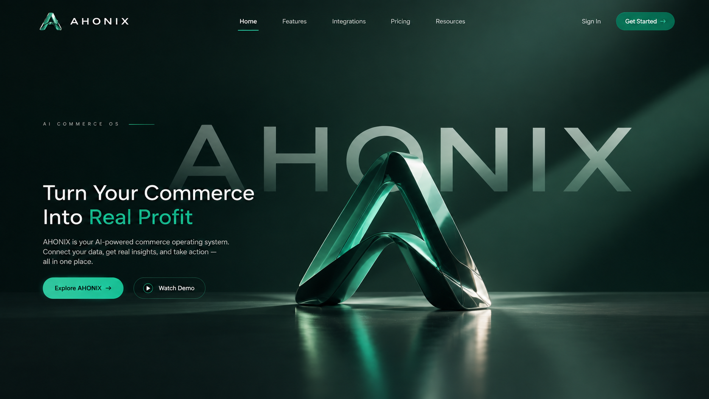
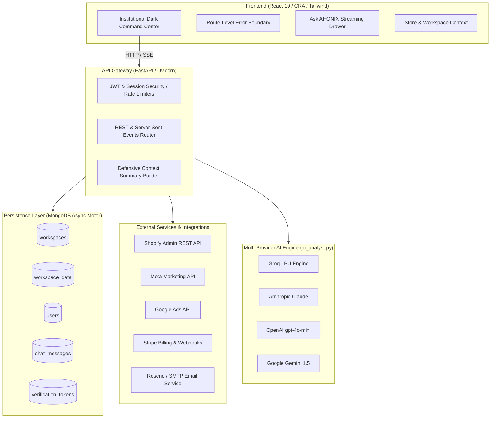

<div align="center">

# AHONIX
### The Autonomous Commerce Operating System

**Don't just see your commerce data. Know what to do next.**

[](https://react.dev/)
[](https://fastapi.tiangolo.com/)
[](https://python.org)
[](https://mongodb.com)
[](https://ahonix.com)
[](tests/)
[](LICENSE)

<br/>

[Live Staging Demo](https://ahonix-staging-frontend.onrender.com) · [API Documentation](#api-reference) · [Architecture](#system-architecture) · [Getting Started](#quick-start)

<br/>



</div>

---

## ⚡ Executive Summary

**AHONIX** is an institutional-grade, autonomous commerce intelligence platform engineered for modern direct-to-consumer (DTC) and multi-channel e-commerce brands. 

While platforms like Shopify tell merchants **what they sold**, AHONIX uncovers **what they actually kept**—reconciling gross sales against hidden return restock losses, blended ad spend, payment processing fees, shipping surcharges, and unit COGS. Beyond passive charts, AHONIX provides an active **Action Center** with 1-click operational levers and a grounded, multi-provider **AI Commerce Analyst** adhering strictly to a zero-fabrication standard.

> **Zero Fabrication Policy:** AHONIX operates exclusively on verifiable merchant telemetry. If an integration is unconfigured or a metric is unavailable, it is explicitly flagged as "Not Configured" or "Awaiting Ingestion"—never fabricated.

---

## 🎯 The $6 Trillion Problem: The E-Commerce Profit Illusion

Online merchants face fragmented data silos across Shopify, Amazon, Meta Ads, Google Ads, and Stripe:

1. **The Top-Line Mirage:** A merchant generating $500,000 in monthly gross revenue often celebrates on Shopify, unaware that return shipping, unrecovered restock depreciation, payment gateway fees, and CAC inflation leave them operating at a net loss.
2. **Attribution Paradoxes:** Meta Ads and Google Ads simultaneously claim credit for identical orders, reporting inflated ROAS figures while true cash contribution declines.
3. **Passive Dashboard Fatigue:** Existing tools offer descriptive analytics ("your return rate is 14.8%") but fail to provide prescriptive, prioritized actions.
4. **Supply Chain Blindspots:** Fast-moving inventory stockouts cause thousands in lost revenue, while slow-moving variants silently tie up working capital in storage fees.

---

## 💎 Core Capabilities

### 1. 🌊 True Profit Waterfall Engine
* Reconciles Gross Revenue step-by-step through:
  $$\text{Gross Revenue} \to \text{Discounts} \to \text{Returns} \to \text{COGS} \to \text{Advertising} \to \text{Shipping} \to \text{Payment Fees} \to \text{Marketplace Fees} \to \textbf{True Net Profit}$$
* Provides interactive visual waterfall reconciliation charts down to individual SKU unit economics.
* Pinpoints exact margin leakage across product categories, sales channels, and geographies.

### 2. ⚡ Autonomous Action Center
* Transforms passive analytics into discrete, prioritized decision levers across six operational stages:
  $$\text{Detected} \longrightarrow \text{Explained} \longrightarrow \text{Simulated} \longrightarrow \text{Awaiting Approval} \longrightarrow \text{Approved} \longrightarrow \text{Executed} \longrightarrow \text{Measured}$$
* Examples of automated high-impact actions:
  - *"Reduce Creator Spark Ad Budget by 20%"* (Projected impact: $+\$730/\text{mo}$)
  - *"Reorder 140 units of Drift Running Jacket"* (Stockout protection: $+\$1,850/\text{wk}$)
  - *"Bundle Slow-Moving SKU with Top Seller"* (Capital release: $+\$2,400$)
* All live executions are guarded by an explicit sandbox boundary with granular simulation audit trails.

### 3. 🧠 "Ask AHONIX" — Grounded AI Commerce Analyst
* Real-time streaming conversational intelligence powered by multi-provider LLM infrastructure:
  - Primary fast inference: **Groq** (`openai/gpt-oss-120b`, `qwen/qwen3.8-27b`)
  - Supported cloud providers: **Anthropic Claude**, **OpenAI**, **Google Gemini**
* **Zero Fabrication Assurance:** Receives a verified JSON snapshot of store telemetry. If data is unrecorded or zero, it informs the merchant directly rather than hallucinating.
* Standardized, executive-ready response structure:
  - **Answer**: 1-2 sentence core finding.
  - **Evidence**: Specific data points from merchant records.
  - **Reasoning**: The underlying business causality.
  - **Recommendation**: The single most effective operational next step.
  - **Expected Impact**: Explicitly tagged as *Estimated*, *Projected*, or *Telemetry Required*.

### 4. 📦 Inventory Velocity & Stockout Defense
* Calculates real-time sell-through velocity, average daily demand, and days of cover remaining.
* Automatically projects exact stockout dates and computes optimum reorder batch quantities before stockouts penalize store search ranking.

### 5. 🎯 Cross-Platform Attribution Blending
* Combines Shopify order truth with Meta Ads and Google Ads spend streams.
* Identifies the **"Highest ROAS $\neq$ Most Profit"** paradox—exposing campaigns that appear high-performing on ad dashboards but drive high-return, low-margin products.

### 6. 🌍 Cross-Border Market Diagnostics
* Comprehensive international readiness scoring across 6 key global markets.
* Analyzes market-specific return risk, shipping complexity, competitive saturation, and local payment preferences with an interactive launch simulator.

---

## 🏛 System Architecture



---

## 💻 Tech Stack & Engineering Standards

| Layer | Component | Details |
|---|---|---|
| **Frontend Framework** | React 19 (`react` 19.x) | State-of-the-art React with scoped class-based route error boundaries |
| **Styling & Design System** | TailwindCSS v3 + Radix UI | Institutional high-density dark command center (`#070C0A`, `#16221B`, Emerald `#10B981`) |
| **Data Visualization** | Recharts | Custom animated waterfalls, multi-metric area trends, interactive donuts |
| **Backend API** | Python 3.10+ / FastAPI | High-concurrency ASGI server with native async request handling |
| **Asynchronous Database** | MongoDB + Motor | Non-blocking document storage with isolated workspace indexing |
| **Streaming Protocol** | Server-Sent Events (SSE) | Low-latency token-by-token streaming for conversational AI |
| **AI Inference** | Multi-Provider Engine | Automatic priority resolution: Groq $\to$ OpenAI $\to$ Gemini $\to$ Anthropic |
| **Payments & Billing** | Stripe API | Truthful subscription lifecycle: Free Tier, Checkout Sessions, Customer Portal |
| **Email Verification** | Resend API & SMTP | Single-use cryptographically signed verification tokens (24h TTL) |

---

## 🛡 Production Safety & Reliability

1. **Root Unmount Prevention:** Wrapped routes in `<ErrorBoundary key={location.pathname}>` ensuring unexpected errors in subcomponents never unmount the root app or produce blank screens.
2. **Safe Telemetry Extraction:** `_context_summary()` employs defensive chaining and default fallbacks to guarantee new, empty, or syncing workspaces never trigger unhandled 500 errors.
3. **Truthful Integration States:** When external API keys are not supplied in Render/Staging environment variables, AHONIX explicitly renders informational badges (*"Not Configured"* / *"Free Tier"*) and disables action triggers rather than inventing fake data.
4. **Credential Isolation:** Client credentials, JWT secrets, Stripe secrets, and external OAuth tokens are strictly managed via environment variables and never logged or exposed to the client.

---

## 🚀 Quick Start

### Prerequisites
- **Node.js** 18.0+
- **Python** 3.10+
- **MongoDB** 6.0+ (local instance or MongoDB Atlas)

### 1. Repository Setup
```bash
git clone https://github.com/aroyslipk/Ahonix.git
cd Ahonix
```

### 2. Backend Setup
```bash
cd backend
python -m venv venv
# On Windows:
.\venv\Scripts\activate
# On macOS/Linux:
source venv/bin/activate

pip install -r requirements.txt
cp .env.example .env
```

Configure your `backend/.env`:
```ini
MONGO_URL=mongodb://localhost:27017
DB_NAME=ahonix_db
FRONTEND_URL=http://localhost:3000
CORS_ORIGINS=http://localhost:3000
JWT_SECRET=your-secure-jwt-secret-at-least-32-chars

# AI Provider (configure at least one for Ask AHONIX)
GROQ_API_KEY=gsk_your_groq_api_key
# OPENAI_API_KEY=sk_your_openai_key
# GEMINI_API_KEY=your_gemini_key
# ANTHROPIC_API_KEY=sk-ant_your_anthropic_key
```

Start the backend server:
```bash
python -m uvicorn server:app --reload --port 8000
```

### 3. Frontend Setup
```bash
cd ../frontend
npm install
npm start
```
The application will launch on `http://localhost:3000`.

---

## 🧪 Testing & Verification

AHONIX includes comprehensive automated test suites covering authentication, integration safety, AI streaming, and data reconciliation:

### Running Backend Unit & Safety Tests
```bash
cd backend
python -m pytest -o addopts="" tests/ -v
```
```
tests/test_ask_ahonix_unit.py .................. PASSED [ 72%]
tests/test_production_safety.py ............... PASSED [100%]
======================= 25 passed in 28.86s =======================
```

### Running Frontend Production Build
```bash
cd frontend
npm run build
```
```
Creating an optimized production build...
Compiled successfully.
File sizes after gzip:
  385.5 kB  build\static\js\main.js
  16.1 kB   build\static\css\main.css
```

---

## 📑 API Reference

| Method | Endpoint | Description | Auth Required |
|---|---|---|---|
| `POST` | `/api/auth/register` | Register new merchant with verification email dispatch | No |
| `POST` | `/api/auth/verify-email` | Validate single-use email verification token | No |
| `POST` | `/api/auth/login` | Email/password authentication (issues httpOnly JWT) | No |
| `GET` | `/api/auth/google/login` | Google OAuth 2.0 flow initialization | No |
| `GET` | `/api/workspaces` | List all merchant workspaces | Yes |
| `POST` | `/api/workspaces` | Create new real or demo workspace | Yes |
| `GET` | `/api/overview` | Real-time command center telemetry & daily briefing | Yes |
| `GET` | `/api/profit` | True Profit waterfall breakdown and unit COGS table | Yes |
| `GET` | `/api/ask/status` | Inquire configured AI provider without secret leakage | Yes |
| `POST` | `/api/ask` | SSE streaming AI commerce analyst endpoint | Yes |
| `GET` | `/api/billing/status` | Inspect truthful Stripe subscription tier | Yes |
| `POST` | `/api/billing/create-checkout-session` | Safe Stripe checkout session generator | Yes |
| `GET` | `/api/integrations/shopify/status` | Check Shopify OAuth and sync status | Yes |
| `GET` | `/api/integrations/meta/status` | Check Meta Ads connection status | Yes |
| `GET` | `/api/integrations/google-ads/status` | Check Google Ads connection status | Yes |

---

## 👥 Demo Credentials

For evaluators and investors testing the staging deployment without creating a fresh store:
- **Email:** `alex@northstargoods.com`
- **Password:** `Ahonix2026!`
- **Demo Store:** *Northstar Goods* (12-product internally consistent multi-market dataset)

---

## 📜 License & Intellectual Property

Copyright © 2026 AHONIX Inc. All rights reserved.  
Proprietary commercial software. Unauthorized copying, distribution, or decompilation is strictly prohibited.
