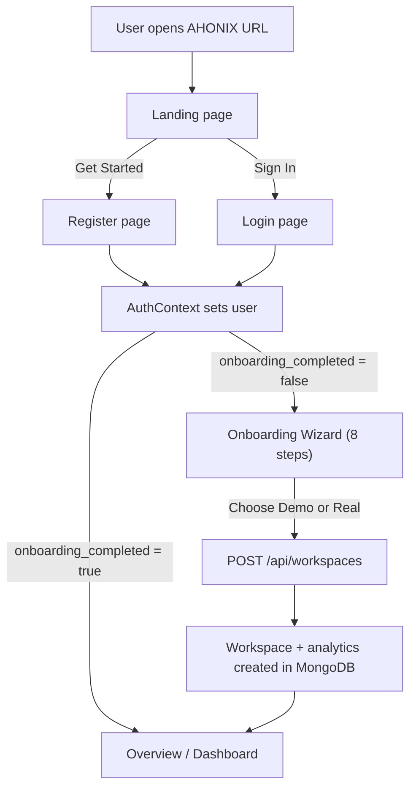
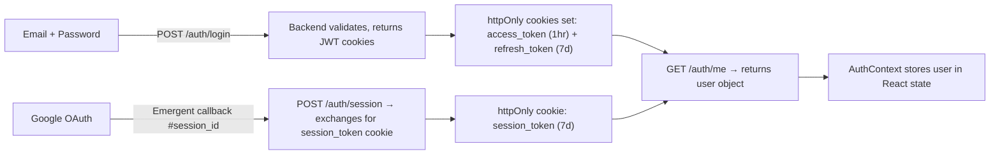

# AHONIX — Complete Project Audit

> **Analysis date:** 2026-09-13 · **No files were modified**

---

## 1. What AHONIX Is & What Problem It Solves

AHONIX is an **AI Commerce OS** — think of it as an intelligent "command center" for online store owners.

**The problem:** A merchant selling on Shopify, Amazon, etc. has sales numbers, ad spend, shipping costs, returns — but no single place that answers: *"What should I actually **do** next to make more money?"* Normal dashboards just show graphs. AHONIX goes further: it finds money leaks, growth opportunities, and risks — explains *why* they matter — and lets you simulate and approve actions safely.

**The central loop:** Connect → Understand → Detect → Explain → Simulate → Recommend → Approve → Execute → Measure.

In plain English: AHONIX connects your commerce data, finds problems (like a product with a 19% return rate eating your margin), explains the evidence, lets you simulate fixing it, approve the fix, "execute" it (safely, in a sandbox), and then measure the result.

---

## 2. User Journey: Opening AHONIX → Dashboard

1. **Landing page** — Premium dark page explaining what AHONIX does
2. **Register / Login** — Email+password (prefilled with demo credentials) or Google OAuth
3. **Auth check** — `GET /auth/me` checks cookie → if no user, redirected to login
4. **Onboarding (first-time only)** — 8-step wizard: welcome → store name → business type → channels → size → country → currency → choose Demo or Real
5. **Workspace created** — Demo mode generates the full "Northstar Goods" analytics dataset; Real mode creates an empty workspace
6. **Dashboard** — `AppLayout` renders: sidebar + topbar + page content + Ask AHONIX drawer

---

## 3. What Each Page Does

### Landing ([Landing.jsx](file:///d:/AHONIX/frontend/src/pages/Landing.jsx))
Marketing page. Shows the AHONIX value proposition, the 9-step AI loop, 4 feature cards (Business X-Ray, True Profit Engine, Ask AHONIX, Forecasts), and a CTA to register. No login required.

### Login / Register ([Login.jsx](file:///d:/AHONIX/frontend/src/pages/Login.jsx) · [Register.jsx](file:///d:/AHONIX/frontend/src/pages/Register.jsx))
- **Login** — Email + password form. **Demo credentials are prefilled** (alex@northstargoods.com / Ahonix2026!) so anyone can try instantly. Also has Google OAuth button. Has "Forgot password?" link.
- **Register** — Name + email + password form. Also has Google OAuth.
- **ForgotPassword / ResetPassword** — Token-based password reset (token printed to server log, no actual email sent).

### Onboarding ([Onboarding.jsx](file:///d:/AHONIX/frontend/src/pages/Onboarding.jsx))
8-step wizard with a progress bar. Collects: store name, business type, sales channels, revenue size, country, currency. Final step: choose "Explore Demo Workspace" (recommended) or "Connect my real data." Creates a workspace via `POST /api/workspaces`.

### Overview ([Overview.jsx](file:///d:/AHONIX/frontend/src/pages/Overview.jsx))
The "command center." Shows:
- Personal greeting with time-of-day
- **Daily AI Briefing** — yesterday's revenue/profit/orders/return rate, what AHONIX noticed, top recommendation
- **6 KPI cards** — Revenue, True Profit, Orders, AOV, Return Rate, Marketing Efficiency (each with sparkline, % change, value badge)
- **Revenue trend** — 12-week area chart
- **AI Priorities** — 3 top insight cards (Money Leak, Growth Opportunity, Operational Risk)
- Demo ribbon when using demo data

### AI Intelligence ([AIIntelligence.jsx](file:///d:/AHONIX/frontend/src/pages/AIIntelligence.jsx))
"Business X-Ray." Has a **scan animation** (radar pulse + dataset check-off) that plays before revealing findings. Shows insights grouped into: Money Leaks, Growth Opportunities, Operational Risks, Customer Issues, Inventory Risks. Each insight card shows: severity, confidence %, title, impact amount, evidence bullets, reasoning, recommendation, and action buttons.

### True Profit ([TrueProfit.jsx](file:///d:/AHONIX/frontend/src/pages/TrueProfit.jsx))
Shows the real profit after *all* hidden costs:
- 4 summary stats: Gross Revenue, Gross Profit, Contribution Margin, True Profit
- **Waterfall chart** — visual bar showing how gross revenue shrinks through discounts, returns, COGS, shipping, ads, payment fees, marketplace fees to arrive at true profit
- **Mismatch insight** — highlights when your best-seller is NOT your most profitable product
- **Product profitability table** — every product ranked by true profit

### Sales ([Sales.jsx](file:///d:/AHONIX/frontend/src/pages/Sales.jsx))
Revenue, orders, and AOV summary cards. Revenue/orders/AOV trend chart (switchable metric). Sales by channel (Shopify vs Amazon bar chart). Revenue by country (donut chart). Top products table.

### Products ([Products.jsx](file:///d:/AHONIX/frontend/src/pages/Products.jsx))
Grid of 12 product cards, each showing a **Health Ring** score (0–100), revenue, margin, return rate, and units sold. Click any card for detailed view.

### Product Detail ([ProductDetail.jsx](file:///d:/AHONIX/frontend/src/pages/ProductDetail.jsx))
Single product deep-dive: health ring (large), stats (units, revenue, true profit, return rate), 12-week revenue trend bar chart, health breakdown bars (demand, profitability, returns, inventory, marketing), and an AI recommendation card. "Ask AHONIX" button pre-fills a question about improving this product.

### Inventory ([Inventory.jsx](file:///d:/AHONIX/frontend/src/pages/Inventory.jsx))
Inventory value, total units, critical/low stock counts. Fast-moving vs slow-moving product lists. **Stock-out forecast table** with: product, stock, daily demand, days left, projected stock-out date, reorder quantity, status badge (Critical / Low / Healthy). FORECAST badge.

### Marketing ([Marketing.jsx](file:///d:/AHONIX/frontend/src/pages/Marketing.jsx))
Ad spend, attributed revenue, blended ROAS, blended CAC. **"Highest ROAS ≠ most profit" paradox card** — a key insight unique to AHONIX. Campaign performance table (spend, ROAS, profit efficiency, contribution — some negative!). Spend by platform bars. Content→Revenue funnel visualization.

### Customers ([Customers.jsx](file:///d:/AHONIX/frontend/src/pages/Customers.jsx))
Total customers, repeat rate, avg LTV, purchase frequency. **RFM-style segments** (Champions, Loyal, Promising, At Risk, Churned) with LTV and return rate per segment. Customers by country donut. Insight cards for high-value customers, churn risk, and repeat opportunity.

### Operations ([Operations.jsx](file:///d:/AHONIX/frontend/src/pages/Operations.jsx))
Three tabs:
- **Shipping** — Shipments, avg delivery, failed delivery rate. Carrier comparison table (SwiftPost, GlobalEx, MetroShip) with cost, speed, reliability, failure rate, volume share.
- **Payments** — Success/failure rate, avg fee, total fees. Payment methods (Card, PayPal, Apple/Google Pay, Klarna) with share and success rate.
- **Returns** — Total returns, return rate, return cost. "Three products drive most returns" insight. Returns by reason (Sizing, Not as described, etc.). Returns by product table.

### Markets ([Markets.jsx](file:///d:/AHONIX/frontend/src/pages/Markets.jsx))
Two tabs:
- **Opportunities** — 6 market cards (US, UK, Germany, Canada, Australia, France) with opportunity score, demand/competition meters, projected margin, shipping complexity, return risk, and AI strategy note.
- **Launch Simulator** — Interactive form: pick country, set price, demand, inventory, budget → run simulation → see projected revenue, profit, orders, CAC, required inventory, return risk, break-even weeks, strategy recommendation. All labelled PROJECTED.

### Action Center ([ActionCenter.jsx](file:///d:/AHONIX/frontend/src/pages/ActionCenter.jsx))
7 actionable recommendations with full lifecycle: Detected → Explained → Simulated → Awaiting Approval → Approved → Executed → Measured. Each card shows: title, description, current vs recommended values, projected impact with value badge, confidence score. Buttons to advance the lifecycle. **Clearly labelled "Sandboxed — no live external actions."** When executed, shows a warning that it's simulated.

### Settings ([Settings.jsx](file:///d:/AHONIX/frontend/src/pages/Settings.jsx))
Current workspace info. Workspace switcher (list, switch, create new demo). **Integrations** section — 8 integrations listed (Shopify, Amazon, WooCommerce, Stripe, Meta Ads, Google Ads, TikTok Ads, ShipStation) with "Connect" buttons that **show a toast: "not enabled in this demo build."** Account info and logout. Explicitly says "architected but not connected."

### Ask AHONIX ([AskAhonix.jsx](file:///d:/AHONIX/frontend/src/components/AskAhonix.jsx))
Slide-in drawer from the right. **Real AI chat** powered by Claude Sonnet 4.6 via SSE streaming. 6 quick prompts. Chat messages are stored in MongoDB. The AI receives a JSON snapshot of the workspace data and responds in a structured format (Answer, Evidence, Reasoning, Recommendation, Expected Impact). Disclaimer: "reasons over demo data."

---

## 4. How Frontend Talks to Backend

| Layer | Detail |
|---|---|
| **HTTP client** | `axios` instance at [api.js](file:///d:/AHONIX/frontend/src/lib/api.js), base URL from `REACT_APP_BACKEND_URL` env var + `/api` |
| **Auth** | `withCredentials: true` — uses httpOnly cookies (access_token, refresh_token, session_token) |
| **Data fetching** | `@tanstack/react-query` via the [`useSection`](file:///d:/AHONIX/frontend/src/lib/hooks.js) hook — each page calls one API endpoint |
| **SSE streaming** | Ask AHONIX uses native `fetch()` with `ReadableStream` for Server-Sent Events |
| **Proxy** | In production, frontend env points directly at backend URL. No Vite proxy (this is CRA/craco) |
| **401 handling** | Axios interceptor auto-redirects to `/login` on 401 for `/app/*` routes |

---

## 5. How Authentication Works

- **JWT tokens** — `access_token` (60 min), `refresh_token` (7 days), `HS256` algorithm
- **Google OAuth** — Via Emergent platform, exchanges session_id for a persistent session_token
- **Brute-force protection** — After 5 failed login attempts, account locked for 15 minutes
- **Password reset** — Token-based, token logged to console (no email service connected)
- **Admin seed** — On startup, creates alex@northstargoods.com with demo workspace

---

## 6. How Workspaces Work

- A **workspace** belongs to a single user (per-user isolation enforced on every endpoint)
- Each user can have multiple workspaces (demo or real)
- **Demo workspace** = full pre-computed analytics from [demo_data.py](file:///d:/AHONIX/backend/demo_data.py)
- **Real workspace** = empty state, shows "Connect your commerce data" message
- Active workspace is stored on the user document (`active_workspace_id`)
- Switching workspaces: `POST /api/workspaces/{id}/select`
- The admin's demo workspace is auto-seeded on server startup, and **auto-regenerated** if `DATA_VERSION` has changed

---

## 7. Real vs Demo vs Estimated Data

| Category | Label | What it means |
|---|---|---|
| **ACTUAL** | Blue badge | Computed directly from the demo product model (deterministic, no randomness). *Would* be real data if integrations were connected. |
| **ESTIMATED** | Amber badge | Derived figure with assumptions (e.g., return cost per unit, customer segments) |
| **PROJECTED** | Green badge | Forward-looking modelled output (e.g., market entry revenue) |
| **FORECAST** | Purple badge | Time-based prediction (e.g., stock-out date based on daily demand) |
| **DEMO** | Grey badge | Explicitly tagged as demo data |

**All data in the current app is simulated.** The demo engine in [demo_data.py](file:///d:/AHONIX/backend/demo_data.py) is deterministic (same inputs → same outputs, no randomness) and internally consistent: revenue, COGS, fees, returns, and profit all derive from the same 12-product model and reconcile mathematically. The data is realistic and coherent, not random placeholder numbers.

**Ask AHONIX** uses a real AI model (Claude Sonnet 4.6) that reasons over the demo data — the AI responses are real, but the underlying data is demo.

---

## 8. Fully Implemented Features ✅

| Feature | Status | Notes |
|---|---|---|
| Auth (email/password JWT) | ✅ Complete | Login, register, logout, refresh, brute-force lockout |
| Auth (Google OAuth) | ✅ Complete | Via Emergent platform |
| Password reset flow | ✅ Architecture | Token created, but no email sent (logged to console) |
| Onboarding (8-step wizard) | ✅ Complete | Creates demo or real workspace |
| Demo data engine | ✅ Complete | 12 products, 12 weeks, all values reconcile |
| Overview / command center | ✅ Complete | KPIs, sparklines, briefing, priorities |
| AI Intelligence / Business X-Ray | ✅ Complete | Scan animation, 5 insight categories |
| True Profit waterfall | ✅ Complete | All cost layers, product profitability |
| Sales analytics | ✅ Complete | Trend, by-channel, by-country, top products |
| Products + health score | ✅ Complete | Grid + detail view with 5-dimension health ring |
| Inventory forecast | ✅ Complete | Stock-out predictions, reorder recommendations |
| Marketing (ROAS vs profit) | ✅ Complete | Paradox insight, campaign table, funnel |
| Customers & LTV | ✅ Complete | Segments, by-country, insight cards |
| Operations (shipping/payments/returns) | ✅ Complete | Three tabs, carrier comparison, return analysis |
| Markets + Launch Simulator | ✅ Complete | 6 markets, interactive simulation |
| Action Center lifecycle | ✅ Complete | 7 actions, full lifecycle, sandboxed |
| Ask AHONIX (AI analyst) | ✅ Complete | Real Claude Sonnet 4.6, SSE streaming, context-grounded |
| Workspace management | ✅ Complete | Create, switch, list workspaces |
| Mobile responsive | ✅ Complete | Bottom nav, hamburger menu, responsive grids |
| Value labelling | ✅ Complete | ACTUAL/ESTIMATED/PROJECTED/FORECAST/DEMO badges |
| data-testid attributes | ✅ Complete | All required test IDs present |
| Backend tests | ✅ Complete | 51/51 pytest passing (regression + QA) |

---

## 9. Incomplete, Demo-Only, or External-Dependent Features ⚠️

| Feature | Status | Detail |
|---|---|---|
| **Real integrations** (Shopify, Amazon, Stripe, Meta, Google Ads, TikTok, ShipStation) | 🔴 Not connected | Buttons exist, show toast "not enabled in this demo." Architecture is ready. |
| **Password reset email** | 🟡 Partial | Token generated, but only printed to server console. No email service wired. |
| **Global search** | 🔴 UI only | Search input in topbar exists but does nothing (no handler) |
| **Notifications** | 🔴 UI only | Bell icon with green dot exists but does nothing |
| **Chat history persistence** | 🟡 Partial | Messages saved to MongoDB, but no UI to view past conversations |
| **Date/country/channel filters** | 🔴 Not implemented | No filter controls on any analytics page. Data is always "last 4 weeks." |
| **CSV export** | 🔴 Not implemented | No export buttons anywhere |
| **Multi-currency FX** | 🔴 Not implemented | Currency symbol changes but all numbers stay the same |
| **Onboarding progress meter** | 🔴 Not implemented | Design guidelines mention it in the header, but it's not present |
| **True Profit in sidebar** | 🔴 Missing | No sidebar link — only accessible via URL or card drill-down |
| **Content→Revenue funnel** | 🟡 Hardcoded | Funnel percentages in Marketing are static constants, not derived from data |

---

## 10. What Could Confuse a Normal Merchant

1. **"It looks real but it's all demo"** — The data is so polished and internally consistent that a merchant might not immediately realize nothing is connected. The DEMO badges help, but they're small.

2. **Currency illusion** — If you select EUR in onboarding, the currency symbol changes to €, but all the numbers stay exactly the same (they're hardcoded in USD). A merchant selecting GBP would see £339,007 revenue, which is the same number as USD — confusing.

3. **"Connect" buttons that don't connect** — The Settings page has 8 "Connect" buttons for integrations. Clicking them shows a toast saying "not enabled," which is honest but could feel like a broken feature.

4. **Search bar that does nothing** — The search input in the topbar is visible on every page but has no functionality. A merchant might try typing and wonder why nothing happens.

5. **Notifications bell** — Has a green dot suggesting there's a notification, but clicking does nothing.

6. **"Execute" actions** — The Action Center lets you "Execute" actions, which feels powerful, but shows a small yellow banner saying "simulated execution." A merchant might not notice the disclaimer.

7. **No True Profit in sidebar** — A merchant would have to discover the True Profit page by clicking on the KPI card or going to `/app/profit` directly. It's not in the navigation.

---

## 11. What Could Look Weak in a Demo/Presentation

1. **No True Profit sidebar link** — During a live demo, navigating to one of the most impressive features requires knowing it exists. An evaluator might never find it.

2. **Static search and notifications** — These are visible on every screen. An evaluator might try them and immediately notice they're non-functional.

3. **No date range filters** — Every analytics page shows "last 4 weeks" with no way to change the period. This is conspicuous for a data product.

4. **Currency doesn't actually convert** — If a presenter demos with EUR or GBP, the numbers are obviously USD amounts with a different symbol.

5. **No "undo" in Action Center** — Once you advance an action to Executed, you can't go back. During a demo, if you click too fast, you've used up that action card.

6. **Password reset only logs to console** — If someone tries "Forgot password?" during a demo, nothing happens from the user's perspective.

7. **The README is still the template README** — It says "farm-ts" and describes a generic skeleton, not AHONIX. An evaluator reading the README would be confused.

---

## 12. Bugs & Technical Risks

### Bug: Login form prefills demo credentials
**File:** [Login.jsx](file:///d:/AHONIX/frontend/src/pages/Login.jsx#L12-L13)
**Risk:** Low for a demo, but shipping credentials in source code is a security anti-pattern. The password `Ahonix2026!` is visible to anyone inspecting the page.

### Bug: Backend `.env` points to a remote preview URL
**File:** [frontend/.env](file:///d:/AHONIX/frontend/.env)
**Risk:** `REACT_APP_BACKEND_URL` points to `https://ahonix-backup.preview.emergentagent.com`. If this Emergent pod goes down, the frontend has no backend. For local development, this needs to be changed to `http://localhost:8001`.

### Risk: `dangerouslySetInnerHTML` in Ask AHONIX
**File:** [AskAhonix.jsx](file:///d:/AHONIX/frontend/src/components/AskAhonix.jsx#L161)
**Risk:** The markdown renderer does basic HTML escaping but doesn't sanitize against all XSS vectors. The AI's response is rendered as raw HTML. Since the AI is the only source, risk is low, but a proper sanitizer (like DOMPurify) would be safer.

### Risk: No request body size limit on `/ask`
**File:** [server.py](file:///d:/AHONIX/backend/server.py#L348)
**Risk:** A user could send an arbitrarily long question string to the LLM endpoint. Should have a max length check.

### Risk: Action mutations modify workspace_data in-place
**File:** [server.py](file:///d:/AHONIX/backend/server.py#L256-L280)
**Risk:** The `mutate_action` endpoint reads the entire actions array, modifies it in memory, and writes it back with `$set`. In a concurrent scenario, this is a race condition. Acceptable for demo, but not production-safe.

### Minor: `TrendingWrapper` inline SVG in Onboarding
**File:** [Onboarding.jsx](file:///d:/AHONIX/frontend/src/pages/Onboarding.jsx#L257-L264)
**Risk:** An inline SVG component is used to avoid a naming conflict with the `TrendingUp` import from lucide-react. Harmless, but unusual.

---

## Prioritized Assessment

### P0 — Critical (Blocks Demo / Breaks Core Flow)

| # | Issue | File | Why It Matters | Fix | Complexity |
|---|---|---|---|---|---|
| P0-1 | **README is still the template "farm-ts" README** | [README.md](file:///d:/AHONIX/README.md) | An evaluator's first impression. Says "farm-ts" and "no app features implemented." Completely misrepresents the project. | Replace with a proper AHONIX README describing what the app is, the tech stack, how to run it, architecture diagram, and screenshots. | Small |
| P0-2 | **Backend URL hardcoded to remote Emergent pod** | [frontend/.env](file:///d:/AHONIX/frontend/.env) | If the Emergent preview URL goes down, the entire app stops working. Local development is impossible without changing this. | Add documentation for local setup. Optionally add a `.env.local` / `.env.example` with `http://localhost:8001`. | Small |

### P1 — Important Before Presentation

| # | Issue | File | Why It Matters | Fix | Complexity |
|---|---|---|---|---|---|
| P1-1 | **No "True Profit" link in sidebar** | [Sidebar.jsx](file:///d:/AHONIX/frontend/src/components/Sidebar.jsx) | True Profit is the most unique and impressive feature. It's invisible in navigation — hidden behind a KPI card click or direct URL. A demo presenter or evaluator may never find it. | Add a sidebar entry between "AI Intelligence" and "Sales" pointing to `/app/profit`. | Small |
| P1-2 | **Global search does nothing** | [TopBar.jsx](file:///d:/AHONIX/frontend/src/components/TopBar.jsx#L72-L78) | Visible on every page. Clicking/typing reveals it's non-functional. Looks broken. | Either implement basic search (filter pages/products by name) or hide/remove the input. A simple "coming soon" tooltip would also work. | Small–Medium |
| P1-3 | **Notifications bell does nothing** | [TopBar.jsx](file:///d:/AHONIX/frontend/src/components/TopBar.jsx#L91-L94) | Green dot implies unread notifications. Clicking does nothing. Looks broken. | Either add a popover saying "No new notifications" or remove the green dot indicator. | Small |
| P1-4 | **Currency doesn't convert — only symbol changes** | [demo_data.py](file:///d:/AHONIX/backend/demo_data.py) | If someone goes through onboarding and picks EUR/GBP, they see €339,007 / £339,007 — clearly wrong (same numbers as USD). Undermines credibility. | Apply a basic FX multiplier to the demo data when `currency != USD` (e.g., EUR → ×0.92, GBP → ×0.79). | Medium |
| P1-5 | **Sales page chart vs KPI period confusion** | [Sales.jsx](file:///d:/AHONIX/frontend/src/pages/Sales.jsx) | KPI cards show "last 4 weeks" totals but the chart shows 12 weeks. A viewer might sum the chart bars and get a different total than the KPI card. The QA report flagged this. | Add a note like "12-week trend for context; KPI totals = last 4 weeks" to the chart caption. | Small |
| P1-6 | **Login form prefills credentials visibly** | [Login.jsx](file:///d:/AHONIX/frontend/src/pages/Login.jsx#L12-L13) | The email and password are hardcoded as initial state. While convenient for demo, it looks unprofessional and is a security anti-pattern. | Keep the prefill for the demo but add a subtle "Demo credentials prefilled" label (already partially there) and consider making it a "one-click demo login" button instead. | Small |

### P2 — UX / Polish

| # | Issue | File | Why It Matters | Fix | Complexity |
|---|---|---|---|---|---|
| P2-1 | **No date range picker on any page** | All analytics pages | Every analytics page is locked to "last 4 weeks" with no date picker. This is conspicuous for a data product. | Add a date range selector UI (even if non-functional in demo — showing "last 4 weeks" as selected with other options greyed out + "coming soon" tooltip). | Medium |
| P2-2 | **Marketing funnel percentages are hardcoded** | [Marketing.jsx](file:///d:/AHONIX/frontend/src/pages/Marketing.jsx#L10-L16) | The Content→Revenue funnel shows static numbers (100%, 46%, 38%, 11%, 7%) regardless of any data. Not derived from the analytics model. | Either derive from campaign data or add a small "illustrative" label (the page already has "Demo attribution model · illustrative drop-off" at the bottom, but it's easy to miss). | Small |
| P2-3 | **No loading/error feedback on "Connect" integration buttons** | [Settings.jsx](file:///d:/AHONIX/frontend/src/pages/Settings.jsx#L105) | Toast says "not enabled" — correct but feels like an error. | Change to a more friendly "Coming soon — this integration will be available when you connect your real store." | Small |
| P2-4 | **Onboarding defaults to "Northstar Goods"** | [Onboarding.jsx](file:///d:/AHONIX/frontend/src/pages/Onboarding.jsx#L52) | Even for a new user registering fresh, the store name defaults to "Northstar Goods". Could be confusing. | Change default to empty string or "My Store" so the user fills in their own name. Keep "Northstar Goods" as placeholder text. | Small |
| P2-5 | **No workspace delete functionality** | [Settings.jsx](file:///d:/AHONIX/frontend/src/pages/Settings.jsx) | Users can create unlimited workspaces but never delete them. Minor clutter. | Add a delete button with confirmation dialog. | Medium |
| P2-6 | **Forgot password UX dead-end** | [ForgotPassword.jsx](file:///d:/AHONIX/frontend/src/pages/ForgotPassword.jsx) | Shows "If an account exists, a reset link has been sent" — but no email is actually sent. User waits forever. | Add a note: "In this demo, check the server console for the reset link." Or disable the feature in demo mode. | Small |
| P2-7 | **Ask AHONIX chat history lost on drawer close** | [AskAhonix.jsx](file:///d:/AHONIX/frontend/src/components/AskAhonix.jsx) | Closing and reopening the Ask drawer clears the conversation. Messages are saved in MongoDB but not reloaded. | Load previous messages from the current session on drawer open. | Medium |

### P3 — Future Features

| # | Feature | Why | Complexity |
|---|---|---|---|
| P3-1 | Real Shopify/Stripe/Meta integrations | Transform from demo to production tool | Large |
| P3-2 | Date/country/channel filters with server-side recompute | Essential for real merchants | Large |
| P3-3 | CSV/PDF export for all data tables | Standard expectation for business tools | Medium |
| P3-4 | Multi-currency FX with real exchange rates | Required for international merchants | Medium |
| P3-5 | Notification feed (real alerts from AI insights) | Keeps users engaged | Medium |
| P3-6 | Per-insight "Ask AHONIX" deep-links with pre-computed context | PRD item, enhances AI experience | Medium |
| P3-7 | Business memory timeline | Track what changed and why over time | Large |

---

## PRD Compliance Check

| PRD Requirement | Status | Notes |
|---|---|---|
| Auth (JWT + Google) | ✅ | Both methods work |
| Protected routes, per-user isolation | ✅ | Verified by 51 passing tests |
| Password reset | 🟡 | Architecture works, no email delivery |
| 8-step onboarding → Demo or Real | ✅ | Fully implemented |
| Overview, AI Intelligence, True Profit | ✅ | All complete |
| Sales, Products (health), Inventory (forecast) | ✅ | All complete with health rings |
| Marketing (ROAS vs profit), Customers (LTV/segments) | ✅ | Paradox insight is excellent |
| Operations (shipping/payments/returns) | ✅ | Three tabs, rich data |
| Markets (opportunities + simulator) | ✅ | Interactive simulation works |
| Action Center (lifecycle) | ✅ | Full 7-stage lifecycle, sandboxed |
| Value labelling (ACTUAL/ESTIMATED/PROJECTED/FORECAST/DEMO) | ✅ | Consistently applied |
| No fake execution (sandboxed) | ✅ | Clear "Sandboxed" label, warning after execution |
| Ask AHONIX (Claude, SSE, grounded on data) | ✅ | Real AI, streaming, context-grounded |
| Responsive (desktop/tablet/mobile) | ✅ | Mobile bottom nav, hamburger menu |
| 30/30 backend tests | ✅ | Now 51/51 after QA hardening |

---

## Design Guidelines Compliance Check

| Guideline | Status | Notes |
|---|---|---|
| Premium dark theme (#08090E background) | ✅ | Exact colors match |
| Emerald primary (#10B981) | ✅ | Used throughout |
| Plus Jakarta Sans / Inter / JetBrains Mono | ✅ | Google Fonts loaded, classes applied |
| KPI cards with trend badge + sparkline | ✅ | All 6 KPIs have sparklines |
| AI Insight cards with severity/confidence | ✅ | All cards match spec |
| Action Center lifecycle stages with correct colors | ✅ | 7 stages, color-coded |
| Ask AHONIX overlay (right drawer) | ✅ | Matches spec exactly |
| Business X-Ray scan animation | ✅ | Radar + pulse + sweep |
| True Profit waterfall elements | ✅ | All cost layers present |
| data-testid attributes | ✅ | All required IDs present |
| Sidebar with 11 nav items | 🟡 | **Missing: True Profit** — only 10 items visible (11 in config but True Profit not listed) |
| Header elements (logo, workspace switcher, search, Ask button, notifications) | 🟡 | Search is non-functional, notifications non-functional |

---

## What Should We Do Next?

Here are the **top 3 highest-value improvements**, in simple terms:

### 1. 🏆 Add "True Profit" to the sidebar navigation
**Why:** True Profit is the single most impressive and unique feature of AHONIX. Right now, a demo viewer or evaluator literally can't find it unless they click the right KPI card or know the URL. Adding it to the sidebar is a 5-minute change that dramatically improves discoverability.

### 2. 📝 Replace the template README with a proper AHONIX README
**Why:** The README is the first thing any evaluator, professor, or technical reviewer reads. Right now it says "farm-ts" and "no app features are implemented" — the opposite of what AHONIX actually is. A proper README with project description, screenshots, architecture, and how to run it transforms the first impression.

### 3. 🔍 Fix the non-functional search bar and notification bell
**Why:** These are visible on every single page. They create an expectation that they work. When they don't, it feels like a half-finished product. Either hide them, add a "coming soon" tooltip, or implement basic functionality (search → filter sidebar items / navigate to pages; notifications → popover saying "No new notifications").

> [!TIP]
> These 3 changes are all **Small** complexity and would take less than an hour combined, but they dramatically improve the demo/presentation experience. After these, the next priority would be **P1-4** (currency conversion) to avoid embarrassment if someone picks a non-USD currency during a live demo.

**I have not modified any files. Waiting for your instruction on what to do next.**
